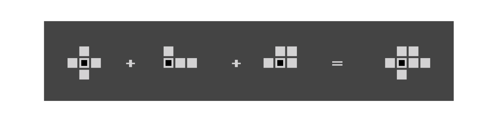

<!--TODO: https://qiita.com/antk/items/e11cac45f9da343e7bf0#md041---%E6%9C%80%E5%88%9D%E3%81%AE%E8%A1%8C%E3%81%AF%E8%A6%8B%E5%87%BA%E3%81%97%E3%83%AC%E3%83%99%E3%83%AB%EF%BC%91%E3%81%A7%E3%81%AA%E3%81%91%E3%82%8C%E3%81%B0%E3%81%AA%E3%82%89%E3%81%AA%E3%81%84 マークダウン50のルールを参照-->

# Synegierへようこそ

    　ようこそ。Synegierへ。
    Synegierは、ドイツ語で「相乗効果」の意味がある「Synergie」から来るタイトルの如く、ゲーム上で展開される相乗効果を駆使して遊びます。多くの相乗効果を得て、このRPG的ゲームのキャラクターと一体になり、迫り来る巨大な脅威に立ち向かいましょう。

    　何よりこのゲームは、プレイの度に前回までとは異なるシナジーを体験できるように設計されているため、毎回毎回新しい相乗効果との出会いを楽しみ、その場その場の状況に適切な対応を発揮する快感を、得ることができます。

    　そうしたいのなら、このルールブックで、ゲームのルールをしっかり理解しましょう。

# 目次

--
<!-- TODO: Markdown All in One: Create Table of Contents　で目次作成 -->

# 準備するもの

* Synegier、本体一式

* プレイヤー：3〜4人を推奨。プレイヤーの頭脳か運が拮抗していると、より面白い。

        プレイヤーの人数は、ゲームのルールに影響はありませんが、ゲームの楽しさには影響するかもしれません。

# アイテムの種類

## ソルジャーカード

    　ソルジャーカードは、各プレイヤーが1枚ずつ所有するプレイヤーのオリジナリティです。それはゲーム中ずっと失われず、他のプレイヤーと差別化されたあなただけのオリジナリティとして力を発揮します.

    　ソルジャーはステータスを持ちます。RPGでいうHP、ATK、DEFの認識で問題ありません。ソルジャーは、ゲーム中レベルアップします。レベルアップによってステータスが伸びます。ステータスの隣に記載されている+数値は、1回レベルアップすると上昇する数値量です。

    　また、各ソルジャーカードは、独自の「コアアビリティ」を持ちます。要は、そのカードだけが持つ特有の能力です。これは、ゲームの中で常に発揮される能力です。プレイヤーは、コアアビリティを軸に、それと相性がいい相乗効果を持つアイテムを駆使しながら戦うのです。
    
    > つまり、ソルジャーカードは、相乗効果の軸となるわけです。

## (ノーマル)カード

    　カードは、実際にプレイヤー同士で、ゲームを進めるために利用されます。ゲーム中、様々なカードと出会い、カードの取捨選択や温存を駆使して、より強い相乗効果を狙います。

    　カードには、色々な情報が記載されています。

    ・ costは、カードを使う際の費用です。0の場合はコスト無しです。
    ・ effectは、カードが単体で持つ能力・できることを表します。
    ・ movementは、後述するソルジャーの移動に用いられる情報です。

    　特筆すべきは、カード中央に記載された色の付いた帯「synegier text」です。
    　synegier textは右寄りのものと、左寄りのものがあります。前者は主語や目的語、後者は動詞を表します。お察しの通り、このテキストは、カード単体では大した効力を発揮しません。同じ色の帯を2枚連ね、その主語と動詞の表す第一文型で記載されたテキストを連結させることで、初めてより強い効果を発揮されるよう設計されています。

    　例えば、ここに2つのカードがあります。聡明なプレイヤーは、これらは連続してプレイすることで必ず黄色か青色が主語と動詞で繋がることに気づきます。この繋がりにより、追加効果が発動します。この繋がりは狙える時は積極的に狙っていきましょう。
    
    　他に重要なのは、どちらを先にプレイしたかで、追加効果の内容が変わっているという点です。状況に応じてどちらの内容がより有利になれるか、考えることができます。

    　カードにはレアリティも存在します。レアリティの高いカードは効果がより強めに設定されています。同じ名前のカードでもレアリティが異なるものも存在します。レアリティは、コモン(C)、レア(R)、スーパーレア(SR)、レジェンド(LE)の4つあります。

    > synegier textを用いたカードの連結で、より強いコンボを決めましょう。

## フィールドとコマ

    　フィールドは、6×6のマス目で構成されており、フィールド上で自分のコマを動かして戦います。全ての物事はフィールド上で起こります。そして、先ほどまでに登場したカードは、フィールドのオブジェクトを動かすための命令手段と認識してください。
    　フィールド上の自分のコマを「ソルジャー」と呼びます。ソルジャーは複数体運用できる場合もあります。フィールドには必ず「エネミー」というコマも存在します。エネミーを攻撃して倒すと、倒したプレイヤーにはいくつかの報酬があります。

## ランダムイベントカード

    　ゲーム中に定期的なタイミングで訪れる、ランダムイベントが定義されたカードです。

## サイコロ

    　ランダムな要素をサイコロが担います。重心の偏っていないサイコロほど、全ての目が均等に出ます。心配性な貴方は、オープンソースでイカサマのできないコンピューティングなサイコロを使いましょう。サイコロは予備も含め、合計で10個あると良いです。

## カウンター

    　ゲーム中に起こる動的な要素を管理するアイテムです。ソルジャーの現在のレベルや、上昇した分を含んだステータス値、所持金など。エネミーのステータスも管理します。

# ゲームの進め方

    　ゲームは、「プリプレイ(準備期間)」、「スイーププレイ(鍛錬期間)」「レイドプレイ(お祭り)」の3つのフェーズに大きく分かれます

## プリプレイ(preply)

    　プリプレイは、いわば準備時間です。2pickと呼ばれる手法であなたのデッキをその場で作り上げ、同時に、自分が用いるソルジャーカードを選定して戦いの準備をします。

    　まず、全種類のソルジャーカードを均等な枚数に分割し、プレイヤーに配ります。余りが生まれる場合は、その余りはゲームから排除します。各プレイヤーは、配られた数枚のソルジャーカードを保持した状態で、2pickに望みます。

    　2pickでは、すべてのプレイヤーに16枚のカードを配るために、カードプールからランダムに選ばれた2枚のカードから1枚を選ぶ行為をを16回繰り返させます。
    　
    　カードのレアリティはある程度統制されて配布されます。
    
    　1. 01-08回目 C:  70%, R:  30%
    　2. 09-13回目 C:  50%, R:  40%, SR: 10%
    　3. 14-15回目 SR: 90%, LE: 5%
    　4.    16回目 LE: 100% 

    　2pickの際には、いつでも先ほど配布されたソルジャーカードを確認できるので、どのソルジャーがこのデッキに生かされそうかを判断します。

    　そして、2pickで16枚のデッキが出来上がったら、最後に配られたソルジャーカードの中から誰を使うか選びます。これにて準備完了です。

## スイーププレイ (sweep-playing)

    　このフェーズでは、フィールドに次々現れるエネミーをスイープ、いわゆる掃討します。それによってレベルアップを図ったり、金銭を貯めたり、相手プレイヤーを妨害したりします。

    　プレイヤーは、あらかじめ決めた順番に従い、1ターンを行動します。1ターンは以下のように進行します。

  1. 山札の上から5枚ドロー。
  2. コストや制限時間の許すだけカードをプレイ、所持金の許す限り物資を購入
  3. プレイしたカードを、プレイ順に連結
    1.  連結で得られた相乗効果を発動
    2.  連結したカードからムーブメントを算出
  4. ムーブメントで算出された範囲に従いフィールド上を移動
  5. 移動後、他のソルジャーなどが近くにいれば、攻撃を仕掛け「バトル」を行える
  6. 手札が1枚以上あるなら1枚残し、残りはトラッシュに捨てて終了
  7. エネミーフィールドに一体もいないなら、エネミーのスポーンを行う

    　これを繰り返します。時点に関わらず、ドローできる山札がない場合は、トラッシュにあるカードをすべて山札に戻します。エネミーを20体倒すか、ダウンの回数が計3回起こると、「レイドプレイ」に移行します。(TODO: 要検討)
    　また、全てのプレイヤーのターンが1周すると、以下のアクションが発生します。

  1. エネミーの攻撃と移動が行われる
  2. ランダムな、ランダムイベントカードをドローし、そのテキストを処理する。

### カードの連結

    　カードをプレイした順に左から右に並べ、カード同士を連結をします。連結した際に、同じ色のsynegier textの隣接があった場合は、その主語と動詞の合体が表す効果テキストである「synegier effect」を発揮します。synegier effectが複数起こった場合は、左から順に行われます。

    　また、ムーブメントの計算もここで行います。例えば3つのカードをプレイし、上図のようなムーブメントアイコンが記載されている場合、それらを全て足し合わせた範囲が算出されます。黒いアイコンは自分の今いる位置を表します。このターン、ソルジャーはこの範囲内を、移動できます。

### バトル

    　バトルを行うことで、HPの減らしあいを行います。特別な指定がない限り、バトルを仕掛ける側は、ソルジャーの周囲8マスにエネミーや他のソルジャーがいれば、そのうち1体を選んでバトルを仕掛けられます。バトルでは、以下の計算方法で、HPのやりとりを行います。
    ・ 攻撃を仕掛けた側のATK - 仕掛けられた側のDEFの値 を、仕掛けられた側のHPから引きます。
    ・ 攻撃を仕掛けられた側のATK - 仕掛た側のDEFの値 を、仕掛けた側のHPから引きます。
    それによってHPが0になったソルジャーやエネミーがいれば、それは「ダウン」します。

### エネミー

    　エネミーのスポーンには、サイコロを用います。サイコロを1回ずつ振り、[1回目に出た目,2回目に出た目]にエネミーを配置します。配置するエネミーの数は、エネミーの累計討伐数で決まります。

    00-03体: 1体
    04-11体: 2体
    12-20体: 3体

    　また、エネミーは後半になるにつれどんどん強くなっていきます。エネミーのステータスは、20体分のエネミーのステータスカードで決まります。スポーン時にサイコロを3回振ることで、エネミーのステータスが決まります。

    　また、エネミーは全員のターンが1周すると攻撃と移動を行います。エネミーは、自身の居る位置からマンハッタン距離2のエリアに全体攻撃を仕掛けます。その際の攻撃力はステータスカードのATKを参照します。攻撃の後、サイコロを2つ振り、出た目のマスに移動します。すでに他のコマがある場合、それがプレイヤーである場合はそのプレイヤーに攻撃を行います。その分岐処理の後、もう一度サイコロを振って別のマスに移動します。

### エネミーのダウン

    　　エネミーをダウンさせたプレイヤーは、1レベルアップし、5コインを入手します。エネミーはダウンするとフィールドから消えます。

### ソルジャーのダウン

    　ソルジャーはダウンすると、任意のフィールドの隅([1,1], [1,6], [6,1], [6,6])にソルジャーを再配置してします。また、プレイヤーにダウンさせられた場合は、そのプレイヤーに所持金を半分奪われます(小数点切り上げ)。

### 購入

    　プレイヤーはフィールドの縁(1の列、6の列、1の行、6の行)にいるときに、実行できます。アイテムは常に5つ売られています。以下の2つのアイテムが固定で配置されています。
    
    1. ミニポーション (3コイン) : ライフが半分回復します。(小数点切り上げ)
    2. ポーション (5コイン) : ライフが全回復します。

    ポーションはどちらか1つしか持てません。
    
    　残り3つのアイテムはカードが販売されており、レアリティに応じて値段が決定されます。売り切れるとカードプールからランダムなカードが選ばれ配置されます。

    C:  1コイン
    R:  3コイン
    SR: 6コイン
    LE: 8コイン

## レイドプレイ (raidplay)

    　スイーププレイからレイドプレイに移行したそのタイミングで、「ボスエネミー」を協力して倒すことに目的が移行します。レイド中は以下の制約が加えられます。

  1. レイドプレイ中にダウンすると復活できない
  2. レイドプレイ中に(普通の)エネミーは出現しない

    　ボスエネミーに対する与ダメージ量で、勝敗が決します。(TODO: 勝敗条件はこれでいいか。そもそもレイドをするか。)

### ボスエネミーのスポーン

    ボスエネミーは「高HP」、「高ATK」、「高DEF」、「バランス」の4タイプいて、そのうちからランダムに選ばれます。通常エネミーと同じく、「ボスエネミーステータスカード」が4種類あるので、選んだタイプのステータスカードを使います。そして、選んだボスを、[3,3],[3,4],[4,3],[4,4]の4つのマスのうちランダムな位置にスポーンさせます。

### ボスエネミーの挙動

    ボスエネミーの挙動は通常のエネミーとやや異なります。ボスエネミーの挙動は以下の流れで行われます。

    1. 全員のターンが終わるとボスエネミーの攻撃が行われる。
    2. 攻撃範囲は通常エネミーと同じく、2マンハッタン距離
    3. 移動2マンハッタン距離の範囲で行われる。サイコロを2個振り、対応する場所に移動する。
